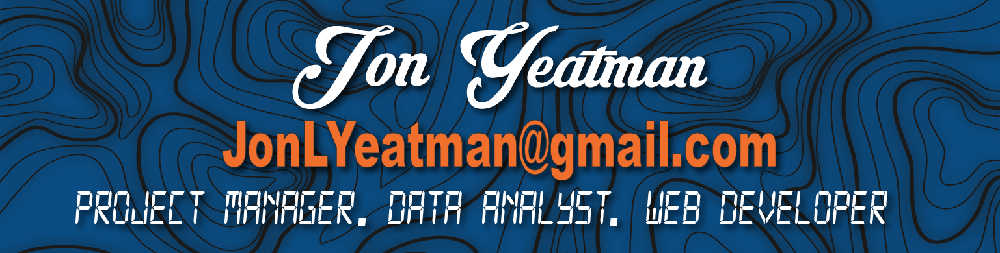

 

<h1 align="center">I am looking forward to collaborating on future projects with you</h1>

<!--   -->

## About Me
Experienced Business Owner with a demonstrated history of working in the computer software and graphics industry. Skilled in Business Planning, Operations Management, Web Design, HTML, CSS, and JavaScript. Strong operations professional with a Certificate focused in Full Stack Web Development from Michigan State University.

---

## Portfolio
http://www.jonlyeatman.com

---

### Stats

  

<!--  -->

### Languages

    

<!--  -->

---
<!--
**Yeatman51/yeatman51** is a ✨ _special_ ✨ repository because its `README.md` (this file) appears on your GitHub profile.

Here are some ideas to get you started:

- 🔭 I’m currently working on ...
- 🌱 I’m currently learning ...
- 👯 I’m looking to collaborate on ...
- 🤔 I’m looking for help with ...
- 💬 Ask me about ...
- 📫 How to reach me: ...
- 😄 Pronouns: ...
- ⚡ Fun fact: ...
-->
